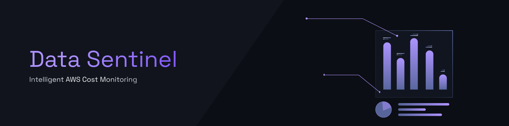
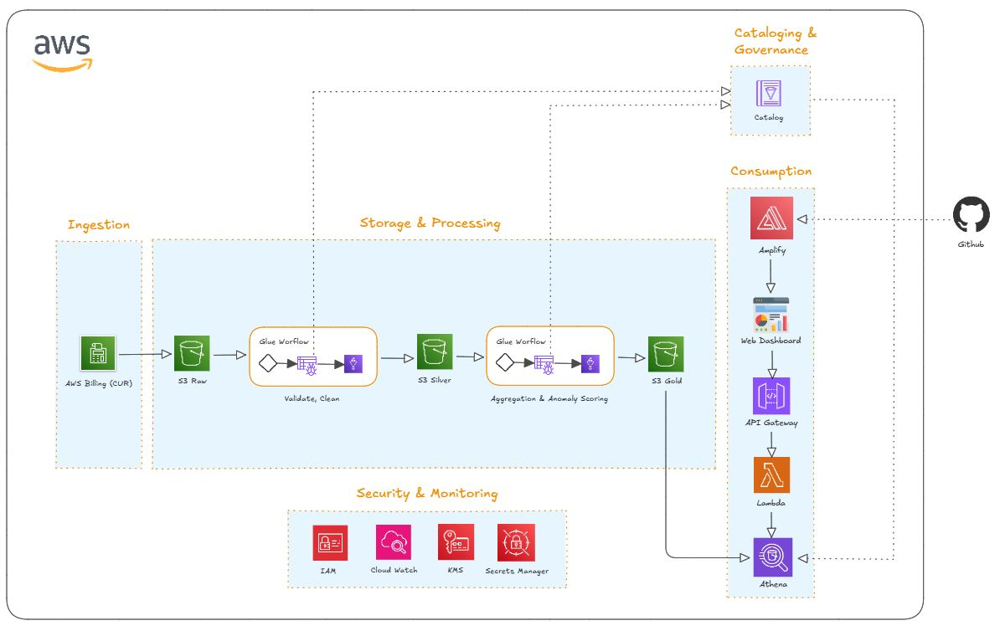
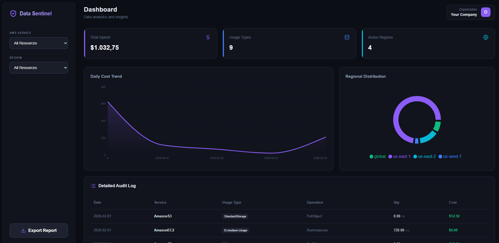

# AWS Sentinel - Cloud Cost Analytics

## Introduction
**AWS Sentinel** is an end-to-end solution designed to transform fragmented cloud billing data into high-level strategic insights. In modern cloud environments, managing costs is as critical as managing infrastructure. This project provides a robust, serverless framework to monitor, audit, and optimize AWS spending using a **Medallion Data Architecture**.

## About the Data Source
The pipeline is designed to consume data from the **AWS Cost and Usage Report (CUR)**. 
* **Granularity**: Provides hourly or daily line items for every AWS resource.
* **Raw Content**: Includes deep metadata such as `usage_type`, `operation`, `product_code`, and `unblended_cost`.
* **Format**: Typically delivered in Parquet or CSV.gz format to an S3 bucket.

## Data Pipeline Overview
The data pipeline follows the **Medallion Architecture**, progressing through three automated ETL stages to ensure high data quality and analytical readiness:

* **Raw Layer (Ingestion)**: Serves as the immutable landing zone for original, unaltered billing files. Data is ingested exactly as provided by the AWS billing source.
* **Silver Layer (Validation & Cleaning)**: Data undergoes a rigorous cleaning process where schemas are enforced. We handle missing values (Null/NaN), standardize data types (converting Costs to `Double` and Dates to `String`), and convert files to **Apache Parquet** for optimized storage and query performance.
* **Gold Layer (Aggregation & Insights)**: The final refined layer where complex business logic is applied. Data is aggregated (Group By) by service, region, and operation to power high-level financial KPIs while maintaining the granularity required for deep-dive auditing in the dashboard.

## Architecture Overview

The project is built entirely on **AWS Serverless** infrastructure to ensure maximum scalability with near-zero idle costs:

* **Storage**: **Amazon S3** organized into Medallion layers (Raw, Silver, Gold) for structured data progression.
* **Processing**: **AWS Glue (Visual ETL)** jobs for data cleaning, schema transformation, and business aggregation.
* **Governance**: **AWS Glue Crawlers** and **Data Catalog** for automated metadata management and schema discovery.
* **Query Engine**: **Amazon Athena** for high-performance SQL analysis directly on S3 Parquet files.
* **Security & Monitoring**: Integrated **IAM** for granular permissions, **KMS** for data encryption, and **CloudWatch** for pipeline monitoring and logging.
* **Backend API**: **AWS Lambda (Python)** integrated with **API Gateway** to secure and expose data via HTTP endpoints.
* **Frontend & Hosting**: **React** dashboard hosted on **AWS Amplify**, featuring **Recharts** for visualization and **Lucide-icons** for a premium UI.

## Implementation Steps

### Phase 1: Storage Setup (S3)
1.  Created a centralized S3 Bucket with folder partitioning: `/raw`, `/silver`, and `/gold`.
2.  Enabled **SSE-S3 encryption** for data-at-rest security.

### Phase 2: Security & Governance (IAM & Glue)
1.  Configured a `GlueServiceRole` with `AmazonS3FullAccess` and `AWSGlueServiceRole` policies.
2.  Implemented **Glue Crawlers** to automatically catalog the `raw` and `gold` tables into the database.

### Phase 3: Processing (Visual ETL)
1.  **Raw to Silver**: Standardized schemas and converted CSV data to **Apache Parquet**.
2.  **Silver to Gold**: Executed complex aggregations (Group By) and handled data quality issues like **Null/NaN** values in usage quantities.

### Phase 4: API & Consumption (Amplify)
1.  **Athena & Lambda**: Developed a Python Lambda to execute SQL queries and return optimized JSON payloads for the frontend.
2.  **API Gateway**: Exposed the Lambda via a REST endpoint with **CORS** support.
3.  **Frontend & Deployment**: Developed a React dashboard featuring daily spending trends, regional distribution, and a **Detailed Audit Log with CSV Export**. Deployed via **AWS Amplify** for automated CI/CD.
